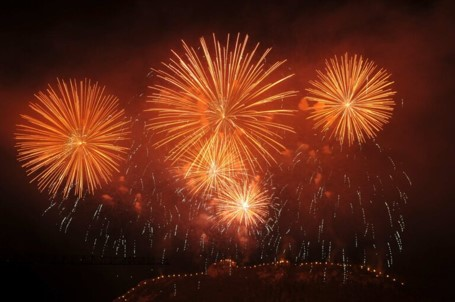
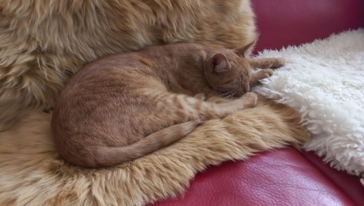
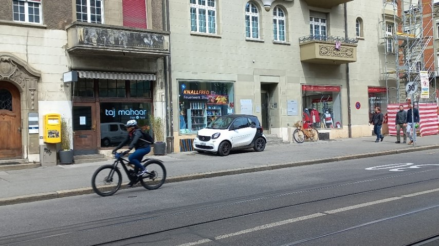
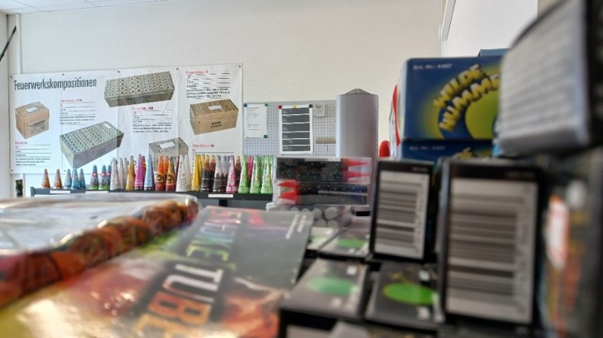
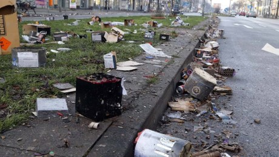

+++
title = "Ist es der Knall wert?"
date = "2023-06-02"
draft = false
pinned = false
tags = ["Deutsch", "Reportage"]
image = "bild5.jpg"
description = "\n\n"
+++
**Jedes Jahr am Ersten August gibt es in der Schweiz eine beobachtbar ansteigende Zahl an toten Tieren, die in jeder Umgebung, sei es in der Stadt, auf der Strassen, oder im Wald gefunden werden. Daran sind offensichtlich diese Feuerwerke, diese Böller und vor allem diese unverantwortlichen Knall-Fanatiker Schuld, oder?
Ist es in der heutigen Zeit noch vertretbar, Sprengstoff zur puren Eigenbelustigung zu verwenden – ist es egoistisch, oder ein gerechtfertigtes Bedürfnis?**
*Von **Christoph Schmocker** und **Samuel Stoll***
**Feuerwerksgeschichte**
Der Ursprung des heutigen Feuerwerks liegt in China (unter anderem deshalb wird auch fast alles Feuerwerk dort produziert). Ein chinesischer Mönch aus der Tang Dynastie (10. Jahrhundert) namens Li Tian erfand das Schwarzpulver. Womit kurz darauf die ersten Feuerwaffen entwickelt wurden (Kanonen, Vorderlader). Pyrotechnik wurde zum Beispiel im 13. Jahrhundert bei der Mongolischen Invasion nach China verwendet, in Form von Brandpfeilen, Flammenwerfern, Leuchtgeschossen, Tretminen aus Bambus, oder auch schon Raketen. Mit der Zeit wurde Feuerwerk nicht mehr nur zum Morden gebraucht, sondern auch zum Feiern. (Chemische Grundlagen der Pyrotechnik)

In der Schweiz ist Feuerwerk für jährlich 78 Tonnen CO2 verantwortlich, dies entspricht etwa 0,0002% der jährlichen CO2 Emissionen der Schweiz. Zum Vergleich: das entspricht in etwa der jährlichen CO2 Emission von 50 Kühen. Dies ist relativ vernachlässigbar. Punkto Feinstaub ist Feuerwerk jedoch für weitaus mehr verantwortlich: jährlich werden 320 Tonnen Feinstaub durch Feuerwerk erzeugt, dies hingegen entspricht etwa 2%, der schweizerischen Feinstaubemissionen. Feuerwerk erzeugt viel Lärm, was für viele Tiere und auch einige Menschen sehr problematisch ist. Für viele Tiere ist der Lärm fast unverträglich, einige verstecken sich im Keller, andere rennen wild und panisch umher. Es wurden schon Rehe beobachtet, die vor lauter Panik in einen Baum rannten und sich dabei tödlich verletzten. Jedoch ist es schwierig zu messen und es gibt auch keine verlässlichen Angaben dazu, wie viele Tiere an Silvester und am ersten August tatsächlich als Folge von Feuerwerk ums Leben kommen. Natürlich ist auch der Verkehr und die teils sehr vielen Menschen an diesen beiden Tagen ein Stressfaktor und Unfallrisiko.
(26.04.2023) in:(https://www.srf.ch/news/schweiz/co2-und-feinstaub-wie-schaedlich-ist-feuerwerk)

**Doch warum knallen?**
Doch warum brennen Menschen heutzutage noch Feuerwerk ab, wo es doch so viele Argumente dagegen gibt? Zum einen ist Feuerwerk in vielen Kulturen eine sehr alte Tradition, schon seit Jahrhunderten zünden Menschen Feuerwerke an, im Mittelalter zum Vertreiben der bösen Geister, oder um die Feinde in die Flucht zu schlagen, heute um etwas zu feiern.
Doch für einige Menschen ist Feuerwerk nicht nur eine Tradition, sie lieben das Farbenspiel und auch das laute Donnern der mächtigen Explosionen. Leider gibt es auch einige Menschen, die Feuerwerk illegal als Waffe einsetzten, wie man am letzten Silvester bei den Ausschreitungen in Berlin sehen konnte. 
**Opfer oder Simulant?**
Edith S. hält ihre Katze Detlef in den Armen und streichelt sie zärtlich, während sie sich über die jährliche «Katastrophe», die sie und ihre Katzen erleiden müssen, beschwert. Die andere Katze Honeyball liegt im Bürozimmer und schläft friedlich. Sie verstehe keinen Menschen, der nur im Ansatz das Tierwohl hinter das Vergnügen der Knallerei stellt. Sie kann kein Verständnis und Empathie gegenüber diesen Menschen zeigen. Eigentlich lebt sie in einem ruhigen Quartier, aber jedes Jahr am 1. August verwandelt sich dieser Ort in einen akustischen Kriegsschauplatz. 

«Ich bin ganz klar dagegen, denn an Silvester haben sie dermassen geknallt, dass meine zwei Katzen verstört im Gang auf dem Teppich lagen, wo sie sonst nie liegen würden. Es war ihnen definitiv nicht wohl gewesen, sie sind nicht weggerannt, oder haben sich im Keller versteckt, aber beide auf dem Teppich liegend habe ich noch nie gesehen. Ich hätte sie in dieser Stresssituation auch nicht in den Arm genommen, die kennen mich gut, aber ich bin mir nicht sicher, ob sie mich nicht gekratzt, oder gebissen hätten. Ich hätte ihnen ja den Fluchtweg versperrt.», sagte sie in klagendem Ton. 
Sie kenne viele Tierbesitzer und deren Tiere, die ebenfalls leiden.
Sie erzählte von einer Familie, die bei ihnen zu Besuch war, am 1. August. Diese hatte ihren Hund im Auto, aber der wollte nicht aussteigen, die Knallerei, «das beginnt am Mittag mit den Frauenfürzen und das knallt ja auch schon durchgehend, dann kommt noch alles andere dazu.» Sie musste ihr eigenes Auto an der Strasse parkieren, damit der Besuch das Auto mit dem Hund in die Garage stellen konnten. «Der Hund wäre draussen nie ausgestiegen!», erzählte sie. Er blieb im Auto, bis sie wieder nachhause fuhren.

Andere Hundebesitzer, wie ihre Nachbarsfamilie, würden über die Tage um den 1. August immer in den Schwarzwald nach Süddeutschland fahren. Mit der Zeit lernten sie viele andere Schweizer Hundebesitzer kennen, die sich jedes Jahr in den gleichen Hotels treffen und dort den Nationalfeiertag zusammen mit ihren Hunden ohne Feuerwerk verbringen.
“Mein alter Hund hätte ein Blindenhund werden sollen und mit denen machen sie so Knalltests, denn die müssten das ja ertragen, damit sie der blinden Person in Stresssituationen nicht davonlaufen. Aus dem Grund hat das unser Hund akzeptiert, weil er das als Blindenhund gemusst hätte.” Deswegen sei diese Massnahme nie nötig gewesen.

Es litten aber nicht nur die Tiere, ihre Nachbarin hatte einen Sohn, der geistig beeinträchtigt war und auch nicht selbständig leben konnte. Ihre eigenen Zwillinge hatten im August Geburtstag, als der Nachbarssohn zu Hause zu Besuch war. Zur Feier für die Kinder holte sie übrig gebliebene Zuckerstöcke und jagte dem armen Nachbar unwissend Panik ein. Seine Mutter kam sofort, und bat sie aufzuhören.
Für ein Verbot sei sie nicht, denn früher und unwissend ging sie gerne das Feuerwerk am Gurten schauen, ausserdem verbiete sie nicht gerne Sachen. “Zuerst aufklären, dann schauen, ob es was bringt, wenn es nichts bringt, dann könnte man ein Verbot überlegen.”, sagte sie dazu.

Ganz anderer Meinung ist Hanspeter Krieg. Er ist seit 5 Jahren stolzer Besitzer des Feuerwerkladens Knallfred in der Berner Innenstadt und beschäftigt sich schon seit seiner frühen Jugend mit Feuerwerken. Heute ist er ein Experte in diesem Gebiet, berät und verkauft täglich Feuerwerk. Hanspeter ist klar gegen ein Feuerwerksverbot, und findet das Abbrennen von Feuerwerkskörpern bedenkenlos. «Feuerwerke sind genau wie Autofahren, wie alles andere, dass auch Tierleid verursachen kann.», sagte Hanspeter mit der Betonung auf der Eigenverantwortung beim Abrennen von Feuerwerkskörpern. Ein Feuerwerksverbot wäre für ihn unverständlich: «Ich würde ein Verbot vor allem nicht begreifen, also ich könnte es mir nicht vorstellen.»

**Chemie des Feuerwerks**
Die meisten Feuerwerkskörper enthalten für die Detonation Schwarzpulver (Kaliumnitrat, Kohle, Schwefel). Jedoch werden bei grossen Raketen, Batterien, oder vor allem bei Gross-Feuerwerk häufig auch Blitzknallsätze verwendet, sie bestehen jeweils aus einem Oxidationsmittel (gibt Sauerstoff ab) und einem Reduktionsmittel (verbraucht den Sauerstoff). Die meistverwendete Mischung in der Pyrotechnik besteht aus Kaliumperchlorat und Aluminiumpulver. Alternativ kommen auch Magnesium und diverse Nitrate und Chlorate als Oxidationsmittel vor. (27.04.2023) in:(https://www.chemie.de/lexikon/Pyrotechnischer_Satz.html)
Warum man teilweise Blitzknallsätze anstatt Schwarzpulver einsetzt, obwohl BKS in der Handhabung viel gefährlicher sind, liegt daran, dass Blitzknallsätze bei gleicher Menge einen viel lauteren Knall abgeben als Schwarzpulver. 
Wie laut ein Knall ist, hängt nicht nur von der Menge des Sprengstoffs ab, sondern von der Detonationsgeschwindigkeit und der Druckanstiegsgeschwindigkeit. Je höher die beiden Parameter sind, desto lauter der Knall und umso stärker die Explosion. Schwarzpulver hat eine Detonationsgeschwindigkeit von 300-600m/s. der Blitzknallsatz dagegen eine von etwa 3000m/s und eine etwa 100-mal stärkere Druckanstiegsgeschwindigkeit.

**Feuerwerksunterteilungen**
Pyrotechnische Artikel werden in der Schweiz und den meisten anderen Ländern je nach Inhaltsstoffen, Mengen und Anwendungszwecken in unterschiedliche Kategorien eingeteilt:

Diese Artikel unterliegen keinerlei Beschränkungen und können frei verkauft werden. 

Darf nicht an Personen unter 12 Jahren abgegeben werden. Umfasst Feuerwerkskörper, die eine sehr geringe Gefahr darstellen, die einen vernachlässigbaren Lärmpegel erzeugen. Für den Verkauf ist keine Verkaufsbewilligung des entsprechenden Kantons notwendig.

Darf nicht an Personen unter 16 Jahren abgegeben werden. umfasst Feuerwerkskörper, die eine geringe Gefahr darstellen, die einen geringen Lärmpegel erzeugen. Für den Verkauf ist eine Verkaufsbewilligung des entsprechenden Kantons notwendig.

Darf nicht an Personen unter 18 Jahren abgegeben werden. Es braucht die Vorlage einer ID (Altersnachweis).  die für die Verwendung in weiten offenen Bereichen im Freien vorgesehen sind und deren Lärmpegel bei bestimmungsgemässer Verwendung die menschliche Gesundheit nicht gefährden. Für den Verkauf ist eine Verkaufsbewilligung des entsprechenden Kantons notwendig.

Diese Artikel sind für den gewerblichen Bereich geeignet und meistens mit elektrischem Zünder ausgestattet. Darf nicht an Personen unter 18 Jahren abgegeben werden. Es braucht die Vorlage einer ID (Altersnachweis) – Es werden keine weiteren Ausweise oder dergleichen benötigt.
Es ist gesetzlich verboten, diese Gegenstände für andere als den vorgesehenen Zweck zu verwenden.

Darf nicht an Personen unter 18 Jahren abgegeben werden. Pyrotechnische Gegenstände haben einen bestimmten jeweiligen Verwendungszweck. Es ist gesetzlich verboten, diesen Gegenstand für andere als den vorgesehenen Zweck zu verwenden.

Darf nicht an Personen unter 18 Jahren abgegeben werden. Pyrotechnische Gegenstände ausser Feuerwerkskörper und pyrotechnische Gegenstände für die Verwendung auf Bühnen, die nur für die Handhabung oder Verwendung durch Personen mit Fachkenntnissen bestimmt sind. Für den Verkauf ist eine entsprechende Verkaufsbewilligung des Kantons notwendig. Es besteht Buchführungspflicht (auch für den Verwender).

Darf nicht an Personen unter 18 Jahren abgegeben werden. Pyrotechnische Gegenstände für zugelassenen Notsignal und Schreckschusspistolen.

Darf nicht an Personen unter 18 Jahren abgegeben werden. Pyrotechnische Gegenstände, die für die Verwendung durch Personen mit Fachkenntnissen auf Bühnen im Innen- und Aussenbereich, einschliesslich der Verwendung bei Film- und Fernsehproduktionen oder ähnlichen Verwendungen
bestimmt sind. Für den Bezug ist ein Erwerbsschein oder eine Abbrennbewilligung nach SprstV Artikel 47 notwendig.
Für den Verkauf ist eine entsprechende Verkaufsbewilligung des Kantons notwendig. Es besteht Buchführungspflicht
(auch für den Verwender). 

Für diese Artikel benötigen Sie einen FWA-Ausweis und eine Abbrenngenehmigung oder einen Erwerbschein. Darf nicht an Personen unter 18 Jahren abgegeben werden.

Für diese Artikel benötigen Sie einen FWB-Ausweis und eine Abbrenngenehmigung oder einen Erwerbschein. Darf nicht an Personen unter 18 Jahren abgegeben werden.
(27.04.2023) in:(https://www.feuerwerkshop.ch/symbolerklaerung-die-feuerwerkskategorien-in-der-uebersicht:_:50.html)
Das meiste bei uns verkaufte Feuerwerk betrifft die Kategorien 1 bis 3. Verkäufe der übrigen Kategorien sind Spezialgeschäften vorbehalten.

**Wird Feuerwerk bald verboten?**
Jeweils vor und nach dem 1. August sowie um Silvester herum, wird häufig über ein generelles Feuerwerksverbot diskutiert. Aktuell läuft eine Unterschriften Sammlung für eine Volksinitiative für eine Einschränkung von Feuerwerk. In Zentren vieler Schweizer Grossstädten gilt schon länger ein Feuerwerksverbot. 
Doch trotz all den negativen Schlagzeilen und den Menschen, die sich für ein Feuerwerksverbot einsetzen, wird es voraussichtlich in den nächsten Jahren kein generelles Feuerwerksverbot in der Schweiz geben. Die Unterschriften Sammlung bekundet auch eher Mühe, die notwendigen 100'000 Unterschriften zu sammeln. Viele Schweizer Stimmbürger sind offenbar trotzdem der Meinung, dass man zweimal im Jahr Feuerwerk zünden darf, wenn man die Überbleibsel fachgerecht entsorgt, keine Sachbeschädigung betreibt und auch ein bisschen Rücksicht auf sein Umfeld nimmt. Schliesslich ist die Haltung vieler auch ambivalent zu anderen Themen wie Autofahren und Flugreisen, bei denen eigentlich klar ist, dass sie auch schädliche Auswirkungen auf Mensch und Natur haben.

